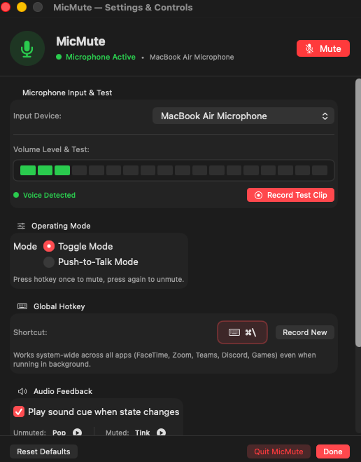

# MicMute 🎙️

A fast, lightweight, and native macOS menu bar application that gives you instant system-wide control over your microphone. Mute or unmute globally using a keyboard shortcut, switch to push-to-talk, test your microphone without ringing feedback loops, and receive pleasant audio feedback cues without interrupting your calls, meetings, or games.

---

## 🖥️ Compatibility

MicMute is designed natively for macOS using Swift, SwiftUI, and AppKit:

- **Supported macOS Versions**: 
  - **macOS 15.0+ (Sequoia)**
  - **macOS 14.0+ (Sonoma)**
  - **macOS 13.0+ (Ventura)**
- **Hardware Architecture**: 
  - **Apple Silicon** (M1, M2, M3, M4)
  - **Intel** Macs (x86_64)

---

## 📸 Visual Overview

### Menu Bar Status Indicators
MicMute lives in your macOS menu bar, giving you an at-a-glance status of your microphone at all times:

| State | Menu Bar Icon | Description |
| :--- | :---: | :--- |
| **Microphone Active** |  | Microphone is unmuted and capturing sound normally. |
| **Microphone Muted** |  | Hardware and software gain set to zero. Completely muted. |

### Settings & Controls Window
The intuitive preferences window allows you to customize shortcuts, switch operating modes, test your microphone, and verify system permissions:

<p align="center">
  
</p>

---

## ✨ Features

### 1. Global Hotkey (`⌘\` Default)
- Works system-wide across all applications—whether you are in **Zoom**, **Google Meet**, **Microsoft Teams**, **Discord**, **FaceTime**, gaming, or browsing.
- You do not need to focus the application to toggle your microphone.
- Keyboard keystrokes are cleanly intercepted so stray characters are not typed into your active document or chat window.
- Fully customizable: click **"Record New"** in Settings to bind your preferred key combination.

### 2. Dual Operating Modes
- **Toggle Mode (Default)**: Press `⌘\` once to mute, press again to unmute.
- **Push-to-Talk Mode**: The microphone remains muted by default and un-mutes only while your hotkey is held down. As soon as you release the key, the microphone immediately mutes again.

### 3. Low-Latency Audio Feedback Cues
- Distinct, low-latency audio tones play through your speakers or headphones so you know your mic status without taking your eyes off your work:
  - 🟢 **Unmuted**: High-tone cheerful sound (`Pop`).
  - 🔴 **Muted**: Low-tone subtle sound (`Tink`).
- Sounds play independently through system audio without delaying or lagging microphone state transitions.
- Can be toggled on/off, and previewed at any time in Settings.

### 4. Hardware-Level CoreAudio Muting
- Directly interfaces with macOS `CoreAudio`.
- Toggles hardware mute (`kAudioDevicePropertyMute`) and simultaneously ramps volume scalar (`kAudioDevicePropertyVolumeScalar`) down to `0.0`.
- Automatically restores your previous input gain level upon unmuting.
- Prevents software audio leakage even in apps that don't respect basic software mutes.

### 5. Input Device Switcher
- Automatically lists all available input devices (Built-in MacBook Microphone, AirPods, USB headsets, studio audio interfaces).
- Seamlessly switch between microphones directly from the menu bar dropdown or preferences menu.

### 6. Microphone Test & Feedback Eliminator
- **Live LED VU Meter**: 18-segment real-time volume bar that indicates audio presence and voice detection.
- **Record & Playback Clip**: Avoids the sharp, loud, ringing acoustic feedback loop caused by live audio pass-through. Click **"Record Test Clip"**, speak into your mic, click **"Stop Test"**, and listen to the playback with full play/pause controls to verify sound quality.

---

## 🚀 How to Use MicMute

1. **Launch the App**: Open `MicMute.app`. The microphone status icon will appear on your top menu bar.
2. **Toggle Mute**:
   - Press **`⌘\`** (`Command + \`) on your keyboard from anywhere.
   - Or click the **MicMute menu bar icon** and select the top item to toggle.
   - Or click the **Mute / Unmute** button in the Settings window.
3. **Open Settings**:
   - Press **`⌘,`** (`Command + ,`) while MicMute is active.
   - Or click the menu bar item and choose **"Preferences / Settings..."**.
4. **Change Modes**:
   - Open Settings and select either **Toggle Mode** or **Push-to-Talk Mode**.
5. **Switch Microphones**:
   - Click the menu bar item, hover over **Microphone**, and select your desired input device.

---

## 🔒 Permissions & Setup Guide

For MicMute to monitor input audio levels and detect global key releases, macOS requires standard system permissions.

### 1. Microphone Permission
Allows MicMute to monitor input levels, test audio, and control hardware volume.
- **How to grant**:
  1. Open **System Settings** ➔ **Privacy & Security** ➔ **Microphone**.
  2. Locate **MicMute** in the list and toggle the switch **ON**.
  3. *(Alternatively, click "Authorize" or "Open Settings" in the MicMute permissions panel).*

### 2. Accessibility Permission
Allows MicMute to detect keyup events for **Push-to-Talk Mode** and provide seamless global key interception.
- **How to grant**:
  1. Open **System Settings** ➔ **Privacy & Security** ➔ **Accessibility**.
  2. Locate **MicMute** in the list and toggle the switch **ON**.
  3. *(If prompted, enter your Mac administrator password or Touch ID).*

> [!TIP]
> **macOS Security Cache Refresh**:
> If you recently updated the app and System Settings already displays the switch as **ON** but MicMute shows the permission as missing, simply **toggle the switch OFF and then back ON once**. This prompts macOS to refresh its security certificate cache for the application.

---

## ⌨️ Keyboard Shortcuts Reference

| Shortcut | Action |
| :--- | :--- |
| **`⌘\`** | Global Mute / Unmute Toggle (or Push-to-Talk hold) |
| **`⌘,`** | Open Preferences / Settings Window |
| **`⌘Q`** | Quit MicMute |

---

## 🛠️ Building from Source

If you wish to build MicMute from source:

### Prerequisites
- macOS 13.0 or later
- Xcode 14.3+ or Swift 5.8+ command line tools

### Build & Run
```bash
# Clone the repository
git clone https://github.com/janny801/mic_mute.git
cd mic_mute

# Build the release application bundle
./scripts/build_app.sh release

# Launch MicMute
open build/MicMute.app
```

---

## 📄 License

Distributed under the MIT License. See `LICENSE` for more information.
